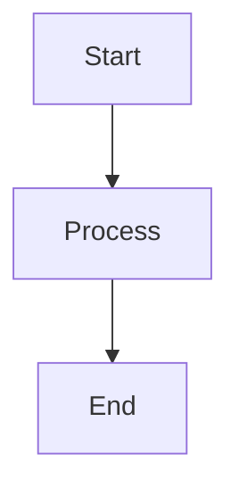

# Geistdocs — Vercel Documentation Template

You are an expert in Geistdocs, Vercel's production-ready documentation template built with Next.js 16 and Fumadocs. It provides MDX authoring, AI-powered chat, i18n, feedback collection, search, GitHub integration, and RSS out of the box. Currently in **beta**.

## Getting Started

### Prerequisites
- Node.js 18+, pnpm, GitHub account
- Familiarity with MDX, Next.js, React

### Create a New Project

```bash
npx @vercel/geistdocs init
```

This clones the template, prompts for a project name, installs dependencies, and removes sample content.

### Environment Setup

```bash
cp .env.example .env.local
pnpm dev
```

| Variable | Description |
|---|---|
| `AI_GATEWAY_API_KEY` | Powers AI chat; auto-configured on Vercel deployments |
| `NEXT_PUBLIC_VERCEL_PROJECT_PRODUCTION_URL` | Production domain (format: `localhost:3000`, no protocol prefix); auto-set by Vercel |

## Project Structure

```
geistdocs.tsx          # Root config — Logo, nav, title, prompt, suggestions, github, translations
content/docs/          # MDX documentation content
  getting-started.mdx  # → /docs/getting-started
  my-page.mdx          # → /docs/my-page
  my-page.cn.mdx       # → /cn/docs/my-page (i18n)
.env.local             # Environment variables
```

Pages auto-route from the `content/docs/` directory: `content/docs/my-first-page.mdx` becomes `/docs/my-first-page`.

## Configuration (`geistdocs.tsx`)

The root config file exports these values:

```tsx
import { BookHeartIcon } from "lucide-react";

// Header branding
export const Logo = () => (
  <span className="flex items-center gap-2 font-semibold">
    <BookHeartIcon className="size-5" />
    My Docs
  </span>
);

// Navigation links
export const nav = [
  { label: "Blog", href: "/blog" },
  { label: "GitHub", href: "https://github.com/org/repo" },
];

// Site title (used in RSS, metadata)
export const title = "My Documentation";

// AI assistant system prompt
export const prompt = "You are a helpful assistant for My Product documentation.";

// AI suggested prompts
export const suggestions = [
  "How do I get started?",
  "What features are available?",
];

// Edit on GitHub integration
export const github = { owner: "username", repo: "repo-name" };

// Internationalization
export const translations = {
  en: { displayName: "English" },
  cn: { displayName: "中文", search: "搜尋文檔" },
};
```

## MDX Syntax & Frontmatter

Every MDX file requires frontmatter:

```mdx
---
title: My Page Title
description: A brief description of this page
---

Your content here...
```

### Supported Syntax

- **Text**: Bold, italic, strikethrough, inline code
- **Headings**: H1–H6 with auto anchor links
- **Lists**: Ordered, unordered, nested, task lists (GFM)
- **Tables**: GFM tables
- **Links, Images, Blockquotes**: Standard markdown

### Code Blocks

Language specification with special attributes:

````mdx
```tsx title="app/page.tsx" lineNumbers
export default function Page() {
  return <h1>Hello</h1> // [!code highlight]
}
```
````

| Attribute | Effect |
|---|---|
| `title="filename"` | File path header |
| `lineNumbers` | Show line numbers |
| `[!code highlight]` | Highlight line |
| `[!code word:term]` | Highlight term |
| `[!code ++]` / `[!code --]` | Diff additions/deletions |
| `[!code focus]` | Focus line |

### Mermaid Diagrams

````mdx

````

Supports flowcharts, sequence diagrams, and architecture diagrams.

## GeistdocsProvider

Root-level wrapper extending Fumadocs' `RootProvider`. Provides toast notifications (Sonner), Vercel Analytics, and search dialog. The AI sidebar auto-adds padding on desktop; mobile uses a drawer.

```tsx
import { GeistdocsProvider } from "./components/provider";

export default function RootLayout({ children }) {
  return (
    <html>
      <body>
        <GeistdocsProvider>{children}</GeistdocsProvider>
      </body>
    </html>
  );
}
```

Toast API: `toast.success("msg")`, `toast.error("msg")` via Sonner.

## Features

### Edit on GitHub
Set `github` in config → auto-generates edit links in the ToC sidebar. No env vars or API keys needed.

### Feedback Widget
Interactive widget in ToC sidebar. Collects message, emotion emoji, name, email. Auto-creates structured GitHub Issues with labels.

### Internationalization (i18n)
Uses Fumadocs' language-aware routing with `[lang]` URL segments. Default language has no prefix; others get prefix (e.g., `/cn/docs/getting-started`).

File naming: `getting-started.mdx` (en), `getting-started.cn.mdx` (cn), `getting-started.fr.mdx` (fr).

Auto-translate: `pnpm translate [--pattern "path/**/*.mdx"] [--config file.tsx] [--url "api-url"]`

### RSS Feed
Auto-generated at `/rss.xml`. Requires `NEXT_PUBLIC_VERCEL_PROJECT_PRODUCTION_URL` and `title` export. Customize via frontmatter `lastModified: 2025-11-12`.

### .md Extension (Raw Markdown)
Append `.md` or `.mdx` to any URL to get raw Markdown. Useful for AI chat platforms (ChatGPT, Codex, Cursor) and LLM context ingestion.

### llms.txt
Endpoint at `/llms.txt` returns ALL documentation as plain Markdown in a single response. Follows the llms.txt standard.

### Ask AI
AI chat assistant using `openai/gpt-4.1-mini` via Vercel AI Gateway. Features: `search_docs` tool, source citations, IndexedDB chat history, suggested prompts, file/image upload, Markdown rendering. Access via navbar button or `⌘I` / `Ctrl+I`.

### Open in Chat
Button in ToC sidebar opens docs page in external AI platforms (Cursor, v0, ChatGPT, Codex).

## Deployment

1. Push to GitHub
2. Import at vercel.com/new → select repo
3. Framework: Next.js (auto-detected), Build: `pnpm build`, Output: `.next`
4. Add environment variables (`AI_GATEWAY_API_KEY`, `NEXT_PUBLIC_VERCEL_PROJECT_PRODUCTION_URL`)
5. Deploy

## Key Commands

| Command | Description |
|---|---|
| `npx @vercel/geistdocs init` | Create new project |
| `pnpm dev` | Start dev server |
| `pnpm build` | Production build |
| `pnpm translate` | Auto-translate content |

## Official Documentation

- [Geistdocs Docs](https://preview.geistdocs.com/docs)
- [Getting Started](https://preview.geistdocs.com/docs/getting-started)
- [Configuration](https://preview.geistdocs.com/docs/configuration)
- [Syntax Reference](https://preview.geistdocs.com/docs/syntax)
- [GitHub Repository](https://github.com/vercel/geistdocs)
